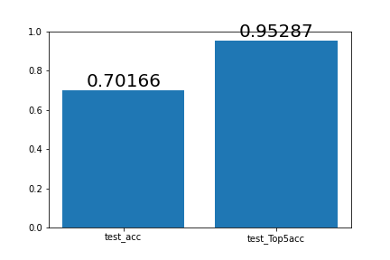

# dishes-classifier
To recognize 50 sorts of dishes.
[Download Model](https://drive.google.com/file/d/1wNCUOXNLnKCPLlkbUyWRyBFt5p16K4CB/view?usp=share_link)

## Environment
Google Colab

Tensorflow

## Approach
Dataset from [教育部校園食材登陸平台](https://fatraceschool.k12ea.gov.tw/frontend/search.html)

Transfer learning from InceptionResnetV2

## Result

